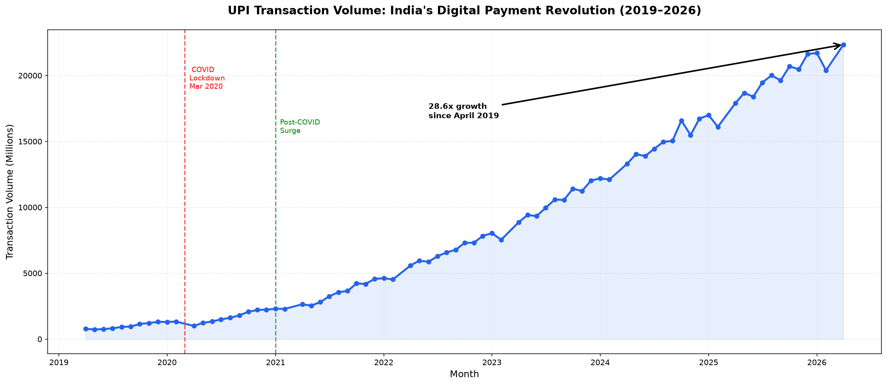
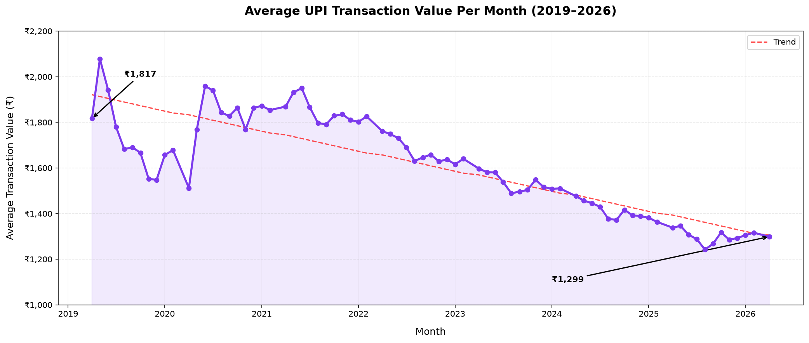
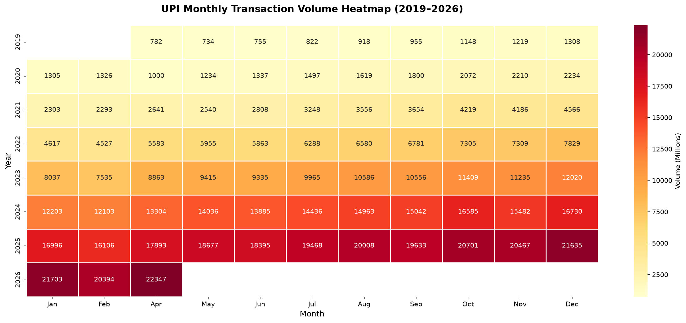

# UPI Behavioural Analysis in India
Time series EDA on 78 months of official NPCI data (April 2019 – May 2026) 
exploring how India's digital payment behaviour actually evolved.

## Key Findings
- Transaction volume grew **28.6x** in 5 years (781M → 22,347M monthly transactions)
- Transaction value grew **20.4x** i.e. slower than volume
- Average transaction value fell **28.5%** i.e. from ₹1,817 to ₹1,299
- **2021** was the real inflection point i.e. two consecutive years of ~100% growth
- October–November consistently outperform every other month, every single year.





## The Core Insight
Volume and value moved in opposite directions, as UPI scaled, the average payment got smaller 
which is the evidence that adoption expanded toward smaller, everyday transactions 
rather than staying concentrated among early urban users.

## Dataset
Official NPCI monthly statistics — [npci.org.in](https://npci.org.in)  
Period: April 2019 to May 2026 (78 months)

## Tools
Python, Pandas, NumPy, Matplotlib, Seaborn, Jupyter Notebook

## Limitations
This data captures only digital UPI transactions. Cash payments, which dominate lower-income segments, are absent.
The declining average transaction value reflects expanding digital adoption, not falling spending, 
true average transaction values across all of India's payment methods are likely lower than this dataset shows.

## How to Run
```bash
pip install pandas numpy matplotlib seaborn openpyxl
jupyter notebook upi_analysis.ipynb
```

